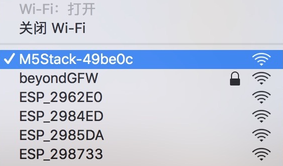
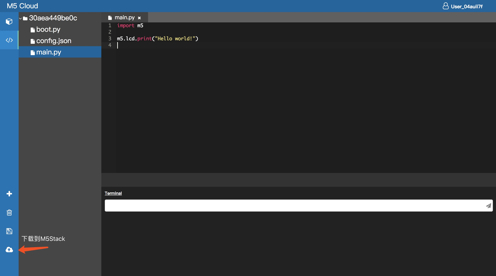

# M5Stack Web IDE

## 快速开始

### 1. 烧录固件

#### MacOS/Linux烧录
- 使用pip安装esptool：

    ```pip install esptool```
- 先擦除:
    ``` esptool.py --chip esp32 --port /dev/tty.SLAB_USBtoUART erase_flash ```
- 烧录bin文件:
    ``` esptool.py --chip esp32 --port /dev/tty.SLAB_USBtoUART write_flash -z 0x1000 firmware.bin ```


#### Windows烧录
Windows使用Espressif提供Flash Download Tools工具烧录([点击下载](http://espressif.com/sites/default/files/tools/flash_download_tools_v3.6.2.2_0.rar))，设置如下(先擦除再烧录)：
   


### 2. 让设备WiFi接入网络
- **方法1:** 使用热点接入，通过Web配置网络
  - 手机或电脑连接M5Stack Core屏幕提示的WiFi热点
  

    连接M5Stack Core WiFi：

    
  - 打开浏览器登陆 192.168.4.1填入WiFi的SSID和密码
  
  
- **方法2:** 通过串口配置WiFi密码

    通过串口REPL或者上传工具在设备根目录下创建一个名字为：config.json的文件，文件内wifi的配置参数JSON格式如下：
    ```
    {
        "wifi":{
            "ssid":"MasterHax_2.4G",
            "password":"12345678"
        }
    }
    ```
- **方法3:** 通过微信扫描二维码Airkiss接入

  TODO

### 3. 绑定设备
  登陆 http://io.m5cloud.com 注册账号,添加设备：

  

  将M5Stack Core屏幕显示的Check Code填入绑定设备，Check Code是一次性随机的，60秒会刷新一次，仅仅用于设备绑定验证。

  
  
  


### 4. 开始编程


# **M5Stack** Micropython

Micropython 快速入门

## **LCD**

---

在使用LCD前，先导入LCD对象:

```python
from m5stack import lcd
lcd.print('hello world!')
```

也可以直接这样：

```python
import m5stack
m5stack.lcd.print('hello world!')
```

或者这样：

```python
import m5stack
lcd = m5stack.lcd
lcd.print('hello world!')
```


#### 颜色

LCD的 **Color** 颜色使用**24bit**整数类型表示,RGB对应各8bit。

比如: **0xFF0000** 相当于于完全红色，**0x00FF00** 相当于原谅色绿色。

常用的颜色可以直接用定义到的参数: 

**BLACK, NAVY, DARKGREEN, DARKCYAN, MAROON, PURPLE, OLIVE, LIGHTGREY, DARKGREY, BLUE, GREEN, CYAN, RED, MAGENTA, YELLOW, WHITE, ORANGE, GREENYELLOW, PINK**

比如想在LCD打印一句绿色的hello world可以这样：
```python
lcd.print('hello world', color=lcd.GREEN)
```

也可以这样：
```python
lcd.print('hello world', color=0X00FF00)
```

### lcd.setColor(color [,bcolor])
设置默认的绘画颜色和背景色，bcolor一般用于设置文字显示的背景色。


### lcd.print(text, [x, y, color])

显示字符串 *text* 在 *(x, y)* 指定的位置，参数 *color* 为颜色参数。 

（注：在中括号如[x, y, color]内的表示为可选参数）

* **x**: 指定水平方向的位置显示, 有以下特殊参数:
  * LASTX(默认), 直接上一个光标的文字接着显示
  * CENTER, 居中显示文本
  * RIGHT, 右对齐文本

* **y**: 指定垂直方向的位置显示, 有以下特殊参数:
  * LASTX(默认), 直接上一个光标的文字接着显示
  * CENTER, 居中显示文本
  * BOTTOM, 文字靠底部显示

* **color**:如果该参数未设置，默认为 *lcd.setColor* 设置的颜色。


### lcd.println(text, [x, y, color])

lcd.println函数功能与 *lcd.print* 函数功能基本一样，只是会在最后自动换行。

```python
lcd.print('hello world\n')
lcd.println('hello world') #显示效果一致
```


### lcd.font(font)

设置字体.

可以使用内置的字体已定义好的参数: 

**FONT_Default, FONT_DefaultSmall, FONT_DejaVu18, FONT_Dejavu24, FONT_Ubuntu, FONT_Comic, FONT_Minya, FONT_Tooney, FONT_Small, FONT_7seg**

```python
lcd.font(lcd.FONT_Dejavu24) #设置为FONT_Dejavu24字体
```

### lcd.textWidth(text)

返回字符串 *text* 字体显示占用的宽度。


### lcd.fontSize()

返回当前字体的 *width* 和 *heigh*。


Example:

```python
from m5stack import lcd

 #在屏幕上hello world
lcd.print('hello world')

#在屏幕x=10,y=100的地方显示hello world
lcd.print('hello world', 10, 100)

#显示的文字颜色为绿色的hello world
lcd.print('hello wrold', color=0xFF0000)

#在屏幕x=10,y=100的地方显示红色的hello world字体
lcd.print('hello world', 10, 200, 0xFF0000) 

#设置字体为FONT_Dejavu24
lcd.font(lcd.FONT_Dejavu24)
lcd.println('hello world')
```


### lcd.pixel(x, y [,color])

画一个像素点在指定位置 (x,y). 如果 *color* 参数未设置, 则默认使用 *lcd.setColor* 设置的前景色.

### lcd.line(x, y, x1, y1 [,color])

画一条直线从坐标(x,y) 到 (x1,y1). 画一个像素点在指定位置 (x,y). 如果 *color* 参数未设置, 则默认使用 *lcd.setColor* 设置的前景色.


### lcd.rect(x, y, width, height, [color, fillcolor])

画一个矩形，(x,y)为矩形左上角的起始坐标，参数 *width* 和 *height* 为设置矩形的宽度和高度。

如果 *color* 和 参数未设置, 则默认使用 *lcd.setColor* 设置的前景色.

可选参数 *fillcolor* 为矩形的填充色。

```python
lcd.rect(10, 100, 100, 200, 0xFF0000) #不填充颜色
lcd.rect(10, 100, 100, 200, 0xFF0000, 0x00FF00) #填充矩形内部为绿色
```

### lcd.triangle(x, y, x1, y1, x2, y2 [,color, fillcolor])

画一个三角形根据指定的三个点 (x,y), (x1,y1) and (x2,y2).


### lcd.circle(x, y, r [,color, fillcolor])

画一个圆，参数(x,y)为圆的原点，*r* 为半径.


### lcd.ellipse(x, y, rx, ry [opt, color, fillcolor])

画一个椭圆 (x,y)和 (rx, ry) 为椭圆的两个焦点.

**opt* 参数用于显示象限, 默认是 15, 显示整个椭圆.

Multiple segments can drawn, combine (logical or) the values.
* 1 - upper left segment
* 2 - upper right segment
* 4 - lower left segment
* 8 - lower right segment

If *fillcolor* is given, filled elipse will be drawn.


### lcd.arc(x, y, r, thick, start, end [color, fillcolor])

画一个圆弧中心点 (x,y)， *r* 为半径，*thick* 为边的厚度，起始角度 *start* 和 *end* 角度（0~360度）。


### lcd.polygon(x, y, r, sides, thick, [color, fillcolor, rotate])

画一个多边形中心点 (x,y)， *r* 为半径, 参数 *sides* 为多边形的边数，*thick* 为边的厚度。

如果设置了 *rotate* 参数, 可以旋转多边形的角度 (0~359)


### lcd.roundrect(x, y, width, height, r [color, fillcolor])

圆角矩形参数 *r* 为圆角的半径.


### lcd.clear([color]) 

等价于lcd.fill([color])

Clear the screen with default background color or specific color if given.

清除屏幕显示的内容，填充指定的颜色，默认是 *lcd.setColor* 设置的背景色。


### lcd.image(x, y, file [,scale, type])

显示图片*file*，(x,y)为起始位置 
* 支持 **JPG** and **BMP** 图片格式.
* Constants **lcd.CENTER**, **lcd.BOTTOM**, **lcd.RIGHT** can be used for x&y
* **x** and **y** values can be negative

**scale**: 图片缩放比例

**type**: 图片的类型 *lcd.JPG* 或 *lcd.BMP* 

## **Button**

---
```python
import m5stack as m5

def press_cb(pin):
    m5.lcd.println('button_press A')
    print('button_press A')
    
m5.BtnA.set_callback(press_cb)
```

或者：

```python
import m5stack as m5

while True:    
  if m5.BtnA.press():
    m5.lcd.println('button_press A')
  time.sleep_ms(10)

```


## **SD Card**

---

```python
import uos

uos.mountsd()
uos.listdir('/sd')
```


## **Beep**

---

```python
import m5stack as m5

m5.beep.tone(freq=1800)
m5.beep.tone(freq=1800, timeout=200)
```

## **GPIO**

---

```python
import machine

pinout = machine.Pin(0, machine.Pin.OUT)
pinout.value(1)

pinin = machine.Pin(2, machine.Pin.IN)
val = pinin.value()
```

## **PWM**

---

```python
import machine

pwm = machine.PWM(machine.Pin(3))
pwm.freq(5000)
pwm.duty(666)
```


## **ADC**

---
```python
import machine

adc = machine.ADC(35)
adc.read()
```


## **I2C**

---
```python
from machine import I2C

i2c = I2C(freq=400000)          # create I2C peripheral at frequency of 400kHz
                                # depending on the port, extra parameters may be required
                                # to select the peripheral and/or pins to use

i2c.scan()                      # scan for slaves, returning a list of 7-bit addresses

i2c.writeto(42, b'123')         # write 3 bytes to slave with 7-bit address 42
i2c.readfrom(42, 4)             # read 4 bytes from slave with 7-bit address 42

i2c.readfrom_mem(42, 8, 3)      # read 3 bytes from memory of slave 42,
                                #   starting at memory-address 8 in the slave
i2c.writeto_mem(42, 2, b'\x10') # write 1 byte to memory of slave 42
                                #   starting at address 2 in the slave
```
## **SPI**

---


## **UART**

---