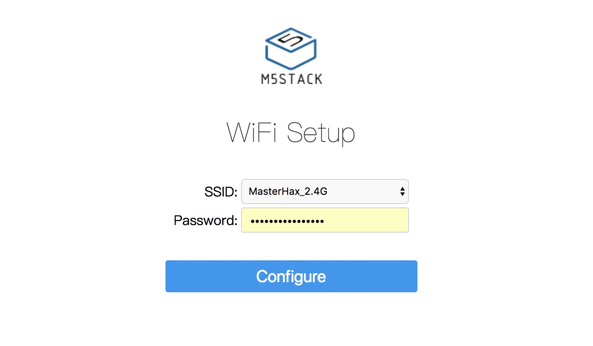
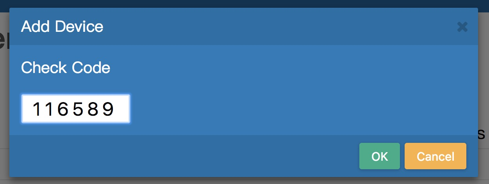

# M5Stack Web IDE

[EN](README.md) | [中文](README_CN.md) | [日本語](README_JP.md)

## Contents
- [はじめに](#%E3%81%AF%E3%81%98%E3%82%81%E3%81%AB)
  - [ファームウェアの書き込み](#1-%E3%83%95%E3%82%A1%E3%83%BC%E3%83%A0%E3%82%A6%E3%82%A7%E3%82%A2%E3%81%AE%E6%9B%B8%E3%81%8D%E8%BE%BC%E3%81%BF)
    - [ダウンロード](#%E3%83%80%E3%82%A6%E3%83%B3%E3%83%AD%E3%83%BC%E3%83%89)
    - [MacOS/Linux](#macoslinux)
    - [Windows](#windows)
  - [WiFiに接続](#2-wifi%E3%81%AB%E6%8E%A5%E7%B6%9A)
  - [デバイスを紐付ける](#3-%E3%83%87%E3%83%90%E3%82%A4%E3%82%B9%E3%82%92%E7%B4%90%E4%BB%98%E3%81%91%E3%82%8B)
  - [プログラムを書く](#4-%E3%83%97%E3%83%AD%E3%82%B0%E3%83%A9%E3%83%A0%E3%82%92%E6%9B%B8%E3%81%8F)
- [MicroPython API](#micropython-api)
  - [<strong>LCD</strong>](#lcd)
  - [<strong>ボタン</strong>](#%E3%83%9C%E3%82%BF%E3%83%B3)
  - [<strong>SDカード</strong>](#sd%E3%82%AB%E3%83%BC%E3%83%89)
  - [<strong>スピーカー</strong>](#%E3%82%B9%E3%83%94%E3%83%BC%E3%82%AB%E3%83%BC)
  - [<strong>GPIO</strong>](#gpio)
  - [<strong>PWM</strong>](#pwm)
  - [<strong>ADC</strong>](#adc)
  - [<strong>DAC</strong>](#dac)
  - [<strong>I2C</strong>](#i2c)
  - [<strong>SPI</strong>](#spi)
  - [<strong>UART</strong>](#uart)
  - [<strong>Timer</strong>](#timer)
  - [<strong>Neopixel</strong>](#neopixel)
- [LoBo MicroPython WiKi](https://github.com/loboris/MicroPython_ESP32_psRAM_LoBo/wiki)
- [Examples](examples)


## はじめに

### 1. ファームウェアの書き込み

#### ダウンロード
[https://github.com/m5stack/M5Cloud/tree/master/firmwares](https://github.com/m5stack/M5Cloud/tree/master/firmwares)

#### MacOS/Linux
- esptoolのインストール： 
    ```pip install esptool```
- Flash ROMの内容を消去（erase）する: 
    ```esptool.py --chip esp32 --port /dev/tty.SLAB_USBtoUART erase_flash ```
- Flash ROMにファームウェアを書き込む:
    ```esptool.py --chip esp32 --port /dev/tty.SLAB_USBtoUART write_flash --flash_mode dio -z 0x1000 firmware.bin ```


#### Windows
WindowsではEspressif Flash Download Toolsが使えます([ダウンロード](https://www.espressif.com/sites/default/files/tools/flash_download_tools_v3.6.4.rar)) (先にEraseを実行してください)：
  


### 2. WiFiに接続
  - M5Stack AP（アクセスポイント）に接続:
  

    WiFiに接続：

  

  - スマートフォンまたはPCブラウザを使い、192.168.4.1を開き、SSIDとパスワードを入力します
  

### 3. デバイスを紐付ける
  ログイン: http://io.m5stack.com を開きアカウント登録およびデバイスの追加を行ってください：

  

  M5Stackのディスプレイに表示されているCheck Codeを参照しサイトに入力してください　Check Codeはランダムな数値で60秒ごとに更新されます

  

  


### 4. プログラムを書く


# MicroPython API

MicroPython入門

## **LCD**

---

M5StackモジュールをImportする:

```python
from m5stack import lcd
lcd.print('hello world!')
```

#### 色について

**色** は24ビット整数値で、各色8ビットごとに表現します。 

たとえば: **0xFF0000** は赤をあらわします。上位6ビットのみが使用されます。

以下の色定数が定義済みで、color引数に指定できます:

**BLACK, NAVY, DARKGREEN, DARKCYAN, MAROON, PURPLE, OLIVE, LIGHTGREY, DARKGREY, BLUE, GREEN, CYAN, RED, MAGENTA, YELLOW, WHITE, ORANGE, GREENYELLOW, PINK**

#### 描画

描画に関する座標値は表示枠に対する相対値です。

初期状態で表示枠は画面全体に設定されています。画面全体の一部を表示枠とするメソッドが用意されています。

#### フォント

9種類のビットマップフォントとひとつの7セグメントフォントが用意されています
フォントファイルを用意すれば、使えるフォントを増やせます。

以下のフォント定数が定義済みで、font引数に指定できます:

**FONT_Default, FONT_DefaultSmall, FONT_DejaVu18, FONT_Dejavu24, FONT_Ubuntu, FONT_Comic, FONT_Minya, FONT_Tooney, FONT_Small, FONT_7seg**


---

## メソッド


### lcd.pixel(x, y [,color])

(x,y)座標にピクセルを描画します<br>
*color* 値が与えられない場合デフォルトの前景色が適用されます。

### lcd.line(x, y, x1, y1 [,color])

(x,y)座標から(x1,y1)座標まで直線を描画します。<br>
*color* 値が与えられない場合デフォルトの前景色が適用されます。

### lcd.lineByAngle(x, y, start, length, angle [,color])

中心座標(x,y)から*start*だけ離れたところを始点として、長さ*lenght*の直線を描画します。<br>
*color* 値が与えられない場合デフォルトの前景色が適用されます。<br>
角度は0-359度の値で表現します

### lcd.triangle(x, y, x1, y1, x2, y2 [,color, fillcolor])

(x,y), (x1,y1) (x2,y2)の3点をむすぶ三角形を描画します<br>
*color* 値が与えられない場合デフォルトの前景色が適用されます。<br>
*fillcolor*が与えられた場合、三角形内を指定の色で塗りつぶします。

### lcd.circle(x, y, r [,color, fillcolor])

(x,y)座標を中心とする半径rの円を描画します<br>
*color* 値が与えられない場合デフォルトの前景色が適用されます。<br>
*fillcolor*が与えられた場合、円の中を指定の色で塗りつぶします。

### lcd.ellipse(x, y, rx, ry [opt, color, fillcolor])

座標（x、y）と（rx、ry）を2つの焦点として楕円を描画します。<br>
*color* 値が与えられない場合デフォルトの前景色が適用されます。<br>
**opt**は楕円形の弧を定義します、デフォルトidは15です

数値を合わせて複数の弧を定義可能です
* 1 - 左上
* 2 - 右上
* 4 - 左下
* 8 - 右下

*fillcolor*が与えられた場合、楕円の中を指定の色で塗りつぶします。

### lcd.arc(x, y, r, thick, start, end [color, fillcolor])

(x,y)座標を中心とし*r*を半径とし、*start*で始点角度、*end*で終点角度とする円弧を描画します<br>
*thick*値により円弧のアウトライン幅を指定します<br>
*fillcolor*が与えられた場合、円弧の中を指定の色で塗りつぶします。

### lcd.poly(x, y, r, sides, thick, [color, fillcolor, rotate])

(x,y)座標を中心とし*r*を半径とする多角形を描画します、*sides*で多角形の辺の数を指定します<br>
*thick*値により多角形のアウトライン幅を指定します<br>
*fillcolor*が与えられた場合、多角形の中を指定の色で塗りつぶします。<br>
*rotate*が与えられた場合、多角形が(0-359)度の角度で回転します。

### lcd.rect(x, y, width, height, [color, fillcolor])

(x,y)を左上の頂点とし、*width*幅および*height*高さをもつ方形を描画します<br>
*fillcolor*が与えられた場合、方形の中を指定の色で塗りつぶします。

### lcd.roundrect(x, y, width, height, r [color, fillcolor])

(x,y)を左上の頂点とし、*width*幅および*height*高さを持ち、四辺の角が丸い方形を描画します<br>
角の丸みの半径を**r**で指定<br>
*fillcolor*が与えられた場合、方形の中を指定の色で塗りつぶします。

### lcd.clear([color])

デフォルトの背景色または*color*で指定した色で画面を消去します。

### lcd.clearWin([color])

デフォルトの背景色または*color*で指定した色で表示枠を消去します。

### lcd.orient(orient)

ディスプレイの表示方向（縦・横）を指定します<br>
定義済みの定数を使います:<br>
**lcd.PORTRAIT**, **lcd.LANDSCAPE**, **lcd.PORTRAIT_FLIP**, **lcd.LANDSCAPE_FLIP**


### lcd.font(font [,rotate, transparent, fixedwidth, dist, width, outline, color])

アクティブなフォントおよびその属性を設定します

| 引数 | 内容 |
| - | - |
| font | 必須、フォント名定数またはフォントファイル名 |
| rotate | オプション、フォントの回転角度を指定 (0~360) |
| transparent | フォントの前景ピクセルのみ描画 |
| fixedwidth | 等幅文字でプロポーショナルフォントを描画、指定フォントの最大幅が適用されます |
| dist | 7セグフォントのみに有効、各バーの間隔を指定 |
| width | 7セグフォントのみに有効、各バーの幅を指定 |
| outline | 7セグフォントのみに有効、アウトラインを描画 |
| color | フォントの色を指定、指定が無い場合は現在の前景色が適用されます |

### lcd.attrib7seg(dist, width, outline, color)

７セグメントフォントの属性を設定

| 引数 | 内容 |
| - | - |
| dist | バー間隔を指定 |
| width | バー幅を指定 |
| outline | アウトラインの色を指定 |
| color | 塗りつぶす色を指定 |


### lcd.fontSize()

アクティブなフォントの幅と高さを返します


### lcd.print(text[,x, y, color, rotate, transparent, fixedwidth, wrap])

*text*文字列を(x,y)座標に表示します.<br>
*color*が指定されていない場合は現在の前景色が適用されます。

* **x**: で文字列の左上ピクセルの水平位置を指定、下記の特殊変数も使用可能:
  * CENTER, 文字列をセンタリング
  * RIGHT, 文字列を右端に揃える
  * LASTX, 最後につかったX座標を使う、LASTX+nでオフセット値適用可
* **y**: で文字列の左上ピクセルの垂直位置を指定、下記の特殊変数も使用可能:
  * CENTER, 文字列をセンタリング
  * BOTTOM, 文字列を下端に揃える
  * LASTY, 最後に使ったY座標を使う、LASTY+nでオフセット値適用可
* **text**: で表示文字列を指定 下記の改行コードを使用可能:
  * ‘\r’ CR (0x0D), 行末まで表示を消去
  * ‘\n’ LF (0x0A), 改行を行い, x=0 にします


### lcd.text(x, y, text [, color])

(x,y)座標に文字列*text*を表示します<br>
*color*が指定されていない場合は現在の前景色が適用されます。

* **x**: で文字列の左上ピクセルの水平位置を指定、下記の特殊変数も使用可能:
  * CENTER, 文字列をセンタリング
  * RIGHT, 文字列を右端に揃える
  * LASTX, 最後につかったX座標を使う、LASTX+nでオフセット値適用可
* **y**: で文字列の左上ピクセルの垂直位置を指定、下記の特殊変数も使用可能:
  * CENTER, 文字列をセンタリング
  * BOTTOM, 文字列を下端に揃える
  * LASTY, 最後に使ったY座標を使う、LASTY+nでオフセット値適用可
* **text**: で表示文字列を指定 下記の改行コードを使用可能:
  * ‘\r’ CR (0x0D), 行末まで表示を消去
  * ‘\n’ LF (0x0A), 改行を行い, x=0 にします


### lcd.textWidth(text)

アクティブなフォントのフォントサイズで*text*文字列の幅を返します

### lcd.textClear(x, y, text [, color])

(x,y)座標で文字列*text*が使用する表示領域を消去します。*color*で指定した背景色が使われます。<br>
*color*が指定されていない場合は現在の背景色が適用されます

### lcd.image(x, y, file [,scale, type])

*file* で指定した画像ファイルを(x,y)座標位置に表示します
* **JPG** および **BMP** が表示可能です
*  **lcd.CENTER**, **lcd.BOTTOM**, **lcd.RIGHT** といった定数をxやyに使用できます
* **x** や **y** はマイナスの値もとることができます

**scale** (jpg): 画像のスケール値を0から3の値で指定できます; scale>0の場合、1/(2^scale)倍となります（したがって1/2, 1/4, 1/8）<br>
**scale** (bmp): 画像のスケール値を0から7の値で指定できます; scale>0の場合、1/(scale+1)倍となります<br>
**type**: 画像のタイプを指定できます（オプション）*lcd.JPG*または*lcd.BMP*が使えます　特に指定が無い場合はファイルの拡張子やコンテンツを元に判定されます


### lcd.setwin(x, y, x1, y1)

アクティブな表示枠を(x,y) - (x1,y1)座標に設定します。


### lcd.resetwin()

アクティブな表示枠を画面全体にリセットします。


### lcd.savewin()

アクティブな表示枠設定を保存します。


### lcd.restorewin()

savewin()で保存したアクティブな表示枠のサイズをリストアします


### lcd.screensize()

画面サイズを返します（幅、高さ）


### lcd.winsize()

アクティブな表示枠のサイズを返します（幅、高さ）


### lcd.hsb2rgb(hue, saturation, brightness)

HSBモデルで指定した色要素をデフォルトのRGBモデルに変換します<br>
24bit整数値で返します

Arguments
* **hue**: float: 整数値部分は取り除かれ、0から1までの小数部分を360倍したHSBカラーモデル用の色相角が適用されます
* **saturation**: float; 0 ~ 1.0
* **brightness**: float; 0 ~ 1.0


### lcd.compileFont(file_name [,debug])

ソースフォントファイル(**.c** 拡張子である必要があります)をコンパイルし、外部フォントとして使用可能なバイナリフォントファイル(**.fon**拡張子)になります<br>
*debug=True*にするとコンパイルしたフォントに関する情報が表示されます

[ttf2c_vc2003.exe](https://github.com/loboris/MicroPython_ESP32_psRAM_LoBo/tree/master/MicroPython_BUILD/components/micropython/esp32/modules_examples/tft/font_tool/)を使って、**ttf**フォントから**c**ソースファイルを生成できます。

詳しい手順については[README](https://github.com/loboris/MicroPython_ESP32_psRAM_LoBo/tree/master/MicroPython_BUILD/components/micropython/esp32/modules_examples/tft/font_tool/README.md)を参照してください

## **ボタン**

---
### メソッド
```python
buttonA.isPressed()
buttonA.isReleased()
buttonA.pressedFor(timeout)

# callbackパラメータが設定されていればcallback関数割り込みが入ります
# callbackパラメータが設定されていない場合は直ちに結果を返します
buttonA.wasPressed(callback=None)
buttonA.wasReleased(callback=None)
buttonA.releasedFor(timeout, callback=None)
```

### 例
ループ:

```python
from m5stack import *
import utime

while True:
  if buttonA.wasPressed():
    lcd.print('Button A was Pressed\n')

  if buttonA.wasReleased():
    lcd.print('Button A was Released\n')

  if buttonA.pressedFor(1.5):
    lcd.print('Button A pressed for 1.5s\n')

  if buttonA.releasedFor(2):
    lcd.print('Button A released for 2s press hold\n')
    
  utime.sleep(0.1)
```

コールバック関数割り込みを使う場合:


```python
from m5stack import *

def on_wasPressed():
  lcd.print('Button B was Pressed\n')

def on_wasReleased():
  lcd.print('Button B was Released\n')

def on_releasedFor():
  lcd.print('Button B released for 1.2s press hold\n')
  
buttonB.wasPressed(on_wasPressed)
buttonB.wasReleased(on_wasReleased)
buttonB.releasedFor(1.2, on_releasedFor)
```

## **SDカード**

---

```python
import uos

uos.mountsd()
uos.listdir('/sd')
```


## **スピーカー**

---

```python
from m5stack import *

speaker.volume(2)
speaker.tone(freq=1800)
speaker.tone(freq=1800, timeout=200) # Non-blocking
```

## **GPIO**

---

```python
import machine

pinout = machine.Pin(0, machine.Pin.OUT)
pinout.value(1)

pinin = machine.Pin(2, machine.Pin.IN)
val = pinin.value()
```

## **PWM**

---

```python
import machine

pwm = machine.PWM(machine.Pin(3))
pwm.freq(5000)
pwm.duty(666)
```


## **ADC**

---
```python
import machine

adc = machine.ADC(35)
adc.read()
```


## **DAC**

---
```python
import machine

dac = machine.DAC(machine.Pin(26))
dac.write(128)
```


## **I2C**

---
```python
from machine import I2C

i2c = I2C(freq=400000, sda=21, scl=22)
                                # I2C機器を400KHzで生成する
                                # ポートによっては周辺機器や使用ピンを指定する
                                # パラメータ指定が必要な場合があります

i2c.scan()                      # スレーブをスキャンする。7bitでリストを返します

i2c.writeto(42, b'123')         # スレーブ7-bitアドレス42に3バイト書き込み
i2c.readfrom(42, 4)             # スレーブ7-bitアドレス42から4バイト読み込み

i2c.readfrom_mem(42, 8, 3)      # スレーブ42メモリのメモリアドレス8から3バイト読み込み
i2c.writeto_mem(42, 2, b'\x10') # スレーブ42メモリのメモリアドレス2から1バイト書き込み
```

## **SPI**

---
```python
from machine import SPI, Pin

spi = SPI(
    spihost=SPI.HSPI,
    baudrate=2600000
    sck=Pin(18),
    mosi=Pin(23),
    miso=Pin(19),
    cs=Pin(4)
)

spi.write(buf) #NOHEAP
spi.read(nbytes, *, write=0x00) #writeは読み込まれる各バイトに対するMOSIの出力となるバイト
spi.readinto(buf, *, write=0x00) #NOHEAP
spi.write_readinto(write_buf, read_buf) #NOHEAP; write_bufとread_bufは同じでも良い

```

## **UART**

---
```python
from machine import UART

uart2 = UART(2, tx=17, rx=16)
uart2.init(115200, bits=8, parity=None, stop=1)
uart2.read(10)       # 10文字を読み取りバイトオブジェクトを返す
uart2.read()         # すべての文字を読み取る
uart2.readline()     # 1行を読み取る
uart2.readinto(buf)  # 読み取って指定されたバッファに保存する
uart2.write('abc')   # 3文字書く
```

## **Timer**

---
tm = machine.Timer(timer_no)

  timer_no引数はタイマーで使用される数値を指定します。
  0-3までの4つのハードウェアタイマーまたは4-11の拡張タイマーを指定可能です。
  拡張タイマーが選択された場合、事前に0がEXTBASEモードで設定されている必要があります。

```python
import machine

tcounter = 0

p1 = machine.Pin(27)
p1.init(p1.OUT)
p1.value(1)

def tcb(timer):
    global tcounter
    if tcounter & 1:
        p1.value(0)
    else:
        p1.value(1)
    tcounter += 1
    if (tcounter % 10000) == 0:
        print("[tcb] timer: {} counter: {}".format(timer.timernum(), tcounter))

t1 = machine.Timer(2)
t1.init(period=20, mode=t1.PERIODIC, callback=tcb)
```

## **Neopixel**

---
```python
import machine, time

np = machine.Neopixel(machine.Pin(22), 24)

def rainbow(loops=120, delay=1, sat=1.0, bri=0.2):
    for pos in range(0, loops):
        for i in range(0, 24):
            dHue = 360.0/24*(pos+i);
            hue = dHue % 360;
            np.setHSB(i, hue, sat, bri, 1, False)
        np.show()
        if delay > 0:
            time.sleep_ms(delay)

def blinkRainbow(loops=10, delay=250):
    for pos in range(0, loops):
        for i in range(0, 24):
            dHue = 360.0/24*(pos+i);
            hue = dHue % 360;
            np.setHSB(i, hue, 1.0, 0.1, 1, False)
        np.show()
        time.sleep_ms(delay)
        np.clear()
        time.sleep_ms(delay)
```


## ブートモード
### セーフブート
リセット後、Aボタンを押したままにしていると、main.pyの実行がスキップされます。

---

M5stackファームウェアは*MicroPython_ESP32_psRAM_LoBo*を元にしています。詳しくは以下の文書を参照してください:
https://github.com/loboris/MicroPython_ESP32_psRAM_LoBo/wiki

---

Japanese translation
  * May, 2018:
    * [Switch Scinence](https://github.com/SWITCHSCIENCE)
    * [MinoruInachi](https://github.com/MinoruInachi)